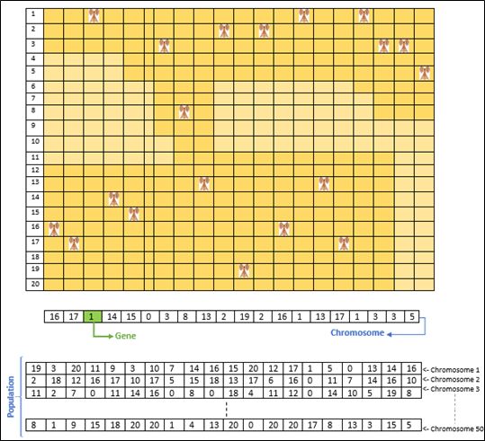
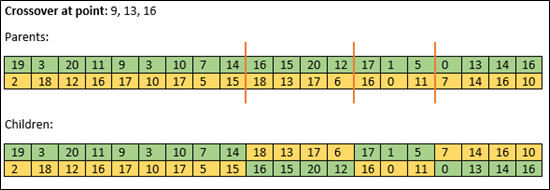
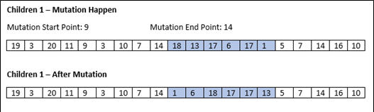
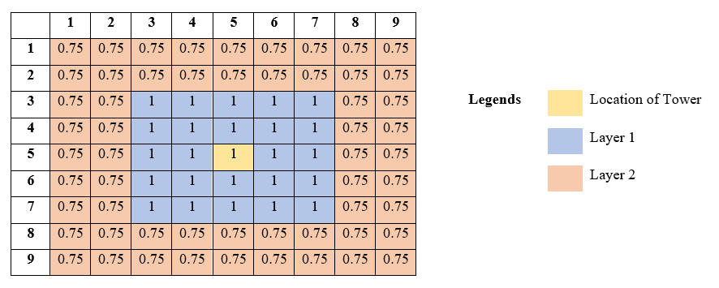
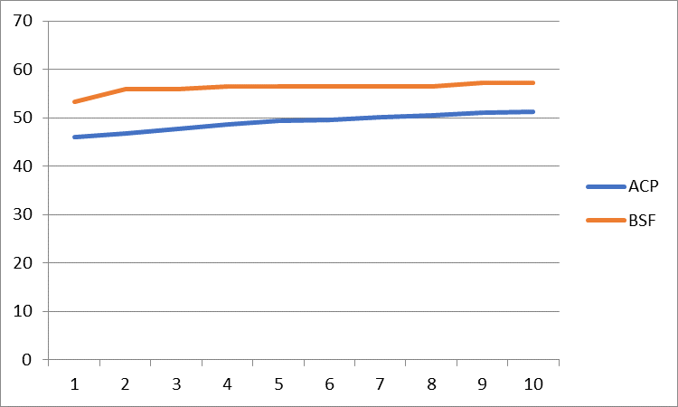

# Telecommunication-Tower-Placement-GA
Telecommunication tower is a structure that houses the antennae, dishes and receivers required for wireless communication and data transfer such as radio and TV broadcasting, cellular phone antennas and towers and others. The problem that needs to be solved in this mini project is to optimize the telecommunication signal coverage by placing the telecommunication tower. The placement of the telecommunication tower is important. 

The figure shows a good and bad placement of the telecommunication tower, only the good placement with less overlapping can solve the problem, whereas the bad placement has a big overlapping so it as a wasted tower. This is to make sure that the telecommunication tower can cover the signal in many areas with fewer telecommunication towers placed. Therefore, we use the Genetic Algorithm (GA) to solve this problem.

## Genetic Algorithm’s design 
### Chromosome Representation

### Fitness Function
There are 2 factors evaluated in fitness function:
1.	**Ensure that the signal received at each plot can be optimized**\
    - The amount of signal received for each place is calculated first according to the distance from telecommunication tower. 
    - The signal received is accumulated if the place is receiving signal from 2 or more telecommunication tower. 
    - Signal amount less than 1 is not enough to support the requirement, but more than 1 is waste of signal energy.
    - The best scenario is each place can receive exactly 1 unit of signal only.
    - Best Scenario = Each Place Cover 1 Signal, 100 if Area is 10 * 10
    - For places that receiving more than 1 unit of signal, fitness value is calculated using 1 divide by the amount of signal received, while the others use the amount of signal received as their fitness value. 
    - The overall fitness value is calculated by divide the sum of fitness value for the area and the best scenario. 

2.	Reduce the required telecommunication tower number 
    - The fitness value is calculated using 1 divide by the number of telecommunication tower
    - This ensure that lower number of telecommunication tower used have higher fitness value

Fitness Function = \
(Total value/Best Scenario) * 80 (Weightage) + 
(1/ Number of used telecommunication tower) * 20 (Weightage)

### Strategy 
1. Parent Selection : Tournament Selection
    - Two chromosomes are selected randomly to compete based on their fitness value. 
    - The highest fitness value will become the parent as a winner. 
    - Repeat the same process to select the next parent until both parents are selected

2. Crossover : Three-Point Crossover
    - 3 crossover point is generated randomly in the range of 0 to 19. 
    - It will split three crossover points in each parent
    - In the parent chromosome, the genes before and after the crossover point are divided into four segments.   
    - Then, each child will inherit a segment from each of the parents

3. Mutation : Scramble Mutation
    - A subset of genes from the crossover chromosome will be picked at random
    - The alleles in those positions will be randomly rearranged

4. Survival Selection: Children Replace Parent

## How To Use
### Parameter
|Parameter |Description |Type |Remarks |
|-|-|-|-|
|GRID_SIZE |Grid Size of the area to place telecommunication tower (Square Size) |Integer | > 1
|COVERAGE_LEVEL |Number of signal level covered by a telecommunication tower |Integer | >= 1
|SIGNAL_STRENGTH |Signal strength for each signal level |Array[Float] |Number of array element must same with COVERAGE_LEVEL. From high to low, start with 1.0| 
|COVERAGE_RADIUS_EACH_LEVEL |Signal radius for each signal level |Integer| >= 1 |
|POP_SIZE |Population Size |Positive Integer | > 1
|CROSSOVER_PROBABILITY |Probability of Crossover |Float | > 0 and <= 1 
|MUTATION_PROBABILITY |Probability of Mutation |Float | > 0 and <= 1 
|MAXIMUM_GENERATION |Maximum generation if termination criteria is not meet |Integer | > 1
|NUM_WEIGHTAGE | The weightage of number of telecommunication tower used in calculating fitness function |Float | > 0 and <= 1 |
|SIGNAL_WEIGHTAGE |The weightage of signal received at each plot in calculating fitness function |Float| > 0 and <= 1 |
|CROSSOVER_POINT | Number of crossover points| Integer| >= 1 |

### Telecommunication Tower Visualization: 
Parameter:
- COVERAGE_LEVEL = 2
- SIGNAL_STRENGTH = [1.0, 0.75]
- COVERAGE_RADIUS_EACH_LEVEL = 2

### Measurement Indices
After running the Genetic Algorithm (GA), The average of current population (ACP) and best so far (BSF) will be recorded in `ACP_File.txt` and `BSF_File.txt`. ACP is to record the average solution in each generation while BSF is to record the best solution found by the algorithm for each generation. While `BC_File.txt` will record the best chromosome (best arrangement of telecommunication tower given the senario).

Another file `Graph.csv` help to visualize the performance of the algorithm using graph. Sample graph: 

