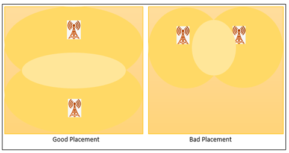

# Telecommunication-Tower-Placement-GA
Telecommunication tower is a structure that houses the antennae, dishes and receivers required for wireless communication and data transfer such as radio and TV broadcasting, cellular phone antennas and towers and others. The problem that needs to be solved in this mini project is to optimize the telecommunication signal coverage by placing the telecommunication tower. The placement of the telecommunication tower is important. 

The figure shows a good and bad placement of the telecommunication tower, only the good placement with less overlapping can solve the problem, whereas the bad placement has a big overlapping so it as a wasted tower. This is to make sure that the telecommunication tower can cover the signal in many areas with fewer telecommunication towers placed. Therefore, we use the Genetic Algorithm (GA) to solve this problem.

## Genetic Algorithm’s design 
1. Chromosome Representation
2. Fitness Function
1. Parent Selection : Tournament Selection
2. Crossover : Three-Point Crossover
3. Mutation : Scramble Mutation
4. Survival Selection
5. Termination Strategy

## How To Use
### Parameter
|Parameter |Description |Type |Remarks |
|-|-|-|-|
|GRID_SIZE |Grid Size of the area to place telecommunication tower (Square Size) |Integer | > 1
|COVERAGE_LEVEL |Number of signal level covered by a telecommunication tower |Integer | >= 1
|SIGNAL_STRENGTH |Signal strength for each signal level |Array[Float] |Number of array element must same with COVERAGE_LEVEL. From high to low, start with 1.0| 
|COVERAGE_RADIUS_EACH_LEVEL |Signal radius for each signal level |Integer| >= 1 |
|POP_SIZE |Population Size |Positive Integer | > 1
|CROSSOVER_PROBABILITY |Probability of Crossover |Float | > 0 and <= 1 
|MUTATION_PROBABILITY |Probability of Mutation |Float | > 0 and <= 1 
|MAXIMUM_GENERATION |Maximum generation if termination criteria is not meet |Integer | > 1
|NUM_WEIGHTAGE | The weightage of number of telecommunication tower used in calculating fitness function |Float | > 0 and <= 1 |
|SIGNAL_WEIGHTAGE |The weightage of signal received at each plot in calculating fitness function |Float| > 0 and <= 1 |
|CROSSOVER_POINT | Number of crossover points| Integer| >= 1 |

### Telecommunication Tower Visualization: 
Parameter:
- COVERAGE_LEVEL = 2
- SIGNAL_STRENGTH = [1.0, 0.75]
- COVERAGE_RADIUS_EACH_LEVEL = 2

### Measurement Indices
After running the Geneti